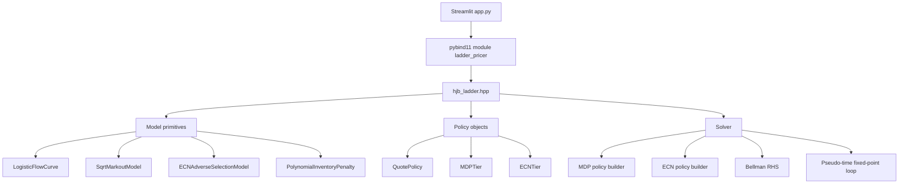

# Trinity 2.0 Ladder Pricer

A mathematical and architectural guide to the 1D inventory HJB ladder pricer.

---

## 1. Purpose

This project solves a **stationary inventory-control problem** for FX market making with two venue types:

- **MDP tiers**: customer-facing, two-sided, size-ladder quotes
- **ECN tiers**: one-sided hedge channels used to reduce inventory

The design goal is to keep the MDP side fully economics-driven while keeping the ECN side simple, monotone, stable, and trader-intuitive.

This README documents the solver family and the simplified ECN design that emerged from the modeling iterations:

- **MDP** = fully optimized ladder, rung by rung
- **ECN** = one-sided hedge venue, passive only, smoothly approaching mid as inventory grows

The codebase contains a few historical ECN variants. This document describes the **simplified profile-based ECN architecture** that was selected as the preferred design target, and also explains the closely related **cap-constrained optimization variant** when useful.

---

## 2. Notation

| Symbol | Meaning |
|---|---|
| $q$ | inventory |
| $z$ | trade size |
| $\delta$ | quote control in normalized spread units |
| $s$ | reference spread |
| $h(q)$ | stationary inventory value function |
| $\lambda(\delta,z)$ | fill/arrival rate |
| $\mu(z)$ | baseline expected markout |
| $\eta$ | ECN toxicity coefficient |
| $f$ | ECN fixed per-fill fee |
| $\Pi(q)$ | inventory penalty |

### Delta convention

The project uses a single normalized delta convention for both sides.

For a quote on spread $s$:

- **Bid relative to mid**:
  $$

  p^{\text{bid}} - m = s(\delta - 0.5)
  
$$
- **Ask relative to mid**:
  $$

  p^{\text{ask}} - m = s(0.5 - \delta)
  
$$

Therefore:

- $\delta < 0.5$: passive quote on the correct side of mid
- $\delta = 0.5$: quote exactly at mid
- $\delta > 0.5$: quote crosses through mid

For the simplified ECN design, we usually enforce:
$$

\delta \le 0.5

$$
so ECN remains passive and never crosses mid.

---

## 3. Flow model

Each tier uses a logistic fill curve.

### 3.1 Arrival scale

$$

A(z) = A_0 z^{-\theta}

$$

where:

- $A_0$ controls overall flow intensity
- $\theta$ controls size decay

### 3.2 Hit ratio

$$

\operatorname{HR}(\delta,z)
= \frac{1}{1 + e^{-y(\delta,z)}}

$$
with
$$

y(\delta,z) = \text{steepness}\cdot\big(\delta - \text{shift} + \text{volume\_shift}(z-1)\big).

$$

### 3.3 Arrival rate

$$

\lambda(\delta,z) = A(z)\operatorname{HR}(\delta,z).

$$

Interpretation:

- larger $\delta$ means a more aggressive quote
- more aggressive quote gives higher fill probability
- size changes the effective 50% fill point through `volume_shift`

---

## 4. Markout and inventory penalty

### 4.1 Baseline markout model

The baseline expected markout is

$$

\mu(z) = \mu_0 + c\sqrt{z}.

$$

This is implemented by `SqrtMarkoutModel`.

### 4.2 Inventory penalty

The solver penalizes warehousing inventory through

$$

\Pi(q)
= \gamma\sigma^2
\left(
\tau_0 |q|^2 + \tau_1 |q|^3 + \tau_2 |q|^4
\right).

$$

Interpretation:

- $\gamma$ = risk aversion
- $\sigma$ = volatility scale
- $\tau_0,\tau_1,\tau_2$ = inventory-holding curvature terms

Higher curvature means stronger incentive to unwind inventory.

---

## 5. Stationary HJB derivation

We use a reduced stationary ansatz of the form

$$

V(x,q,s) = x + q s + h(q),

$$

where:

- $x$ is cash
- $s$ is spot / mid price
- $h(q)$ captures the continuation value of inventory

The code solves for $h$ on a 1D symmetric inventory grid.

### 5.1 One-step expected contribution

Suppose a quote with control $\delta$ and size $z$ generates fills at rate $\lambda(\delta,z)$.
Over a short time step $dt$, the expected contribution is approximately

$$

\lambda(\delta,z)dt \cdot
\Big(
\text{execution value}
-
\text{expected markout}
+
\text{inventory jump value}
\Big).

$$

Dropping the common factor $dt$ yields the stationary Bellman contribution per unit time.

### 5.2 Inventory jump value

For a fill that changes inventory from $q$ to $q'$, the continuation-value increment is

$$

\Delta h = h(q') - h(q).

$$

So:

- bid fill: $q' = q+z$
- ask fill: $q' = q-z$

---

## 6. MDP tier derivation

MDP tiers are customer-facing and two-sided.

### 6.1 Bid contribution

A customer selling to our bid increases inventory by $z$. The contribution is

$$

H^{\text{MDP,bid}}(q,z,\delta)
=
\lambda(\delta,z)
\Big[
zs(0.5-\delta)
-
z\mu(z)
+
h(q+z)-h(q)
\Big].

$$

### 6.2 Ask contribution

A customer buying from our ask decreases inventory by $z$. The contribution is

$$

H^{\text{MDP,ask}}(q,z,\delta)
=
\lambda(\delta,z)
\Big[
zs(0.5-\delta)
-
z\mu(z)
+
h(q-z)-h(q)
\Big].

$$

### 6.3 Ladder objective

For each MDP tier, the total contribution at inventory $q$ is

$$

H^{\text{MDP}}(q)
=
\sum_{z \in \mathcal Z}
H^{\text{MDP,bid}}(q,z,\delta^{b}(q,z))
+
\sum_{z \in \mathcal Z}
H^{\text{MDP,ask}}(q,z,\delta^{a}(q,z)).

$$

The solver optimizes every rung $\delta(q,z)$ using golden-section search under monotonicity bounds.

---

## 7. MDP ladder monotonicity and bounds

The MDP ladder is built rung by rung.

The code imposes inventory-dependent and rung-dependent bounds to preserve economically sensible size ladders.

### 7.1 Cross-size monotonicity

For each side and inventory state, larger sizes must not become more competitive than smaller sizes. This is implemented by recursive upper bounds:

$$

\delta_j \le \delta_{j-1}.

$$

### 7.2 Cross-inventory consistency

As inventory changes from one grid row to the next, the ladder is constrained to evolve smoothly so that its gaps do not behave erratically.

This is handled by the `mdp_bid_bounds_for_rung` and `mdp_ask_bounds_for_rung` logic.

The effect is:

- the risk-reducing side can tighten gradually
- the risk-increasing side can widen gradually
- ladder gaps remain well behaved across inventory rows

---

## 8. Simplified ECN design

The ECN is not modeled as a full symmetric market-making venue.
It is modeled as a **one-sided hedge channel**.

### 8.1 Behavioral assumptions

1. ECN is used only to **reduce** inventory
2. If $q>0$ (long), only the **ask** side is active
3. If $q<0$ (short), only the **bid** side is active
4. At $q=0$, ECN is **off**
5. ECN quote should move **smoothly toward mid** as $|q|$ grows
6. ECN should remain **passive**, so it should not cross mid

So the admissible side is:

$$

\text{side}(q)=
\begin{cases}
\text{ask}, & q>0,\\
\text{off}, & q=0,\\
\text{bid}, & q<0.
\end{cases}

$$

### 8.2 ECN cost model

The simplified ECN fill cost is

$$

C^{\text{ECN}}(\delta,z)
=
z\mu(z) + z\eta\max(\delta,0) + f.

$$

Here:

- $z\mu(z)$: baseline markout cost
- $z\eta\max(\delta,0)$: additional toxicity for more aggressive quoting
- $f$: flat per-fill fee

This is intentionally simple and interpretable.

### 8.3 ECN Bellman contribution

For a long inventory state $q>0$, the active ask-side contribution is

$$

H^{\text{ECN,ask}}(q,\delta)
=
\lambda(\delta,1)
\Big[
s(0.5-\delta)
-
C^{\text{ECN}}(\delta,1)
+
h(q-1)-h(q)
\Big].

$$

For a short inventory state $q<0$, the active bid-side contribution is

$$

H^{\text{ECN,bid}}(q,\delta)
=
\lambda(\delta,1)
\Big[
s(0.5-\delta)
-
C^{\text{ECN}}(\delta,1)
+
h(q+1)-h(q)
\Big].

$$

Notice that ECN size is fixed to
$$

z=1.

$$

---

## 9. ECN profile-based quoting

This is the preferred simplification when the hedge curve itself should be trader-intuitive and visually well behaved.

### 9.1 Mid cap

Define the passive mid cap

$$

\delta_{\text{mid}} = \min(\delta_{\max}, 0.5).

$$

This ensures the ECN quote never crosses mid.

### 9.2 Finite-saturation profile

Let $q_\star > 0$ be the inventory level at which the ECN quote should reach the mid cap.
Define

$$

u(q) = \min\left(\frac{|q|}{q_\star}, 1\right).

$$

Use a smoothstep profile

$$

S(u)=3u^2-2u^3,
\qquad u\in[0,1].

$$

Then the ECN quote profile is

$$

\delta_{\text{ECN}}(q)
=
\delta_{\min}
+
\big(\delta_{\text{mid}}-\delta_{\min}\big)
S\big(\nu(q)\big).

$$

Properties:

- at $q=0$:
  $$

  \delta_{\text{ECN}}(0)=\delta_{\min}
  
$$
- at $|q|=q_\star$:
  $$

  \delta_{\text{ECN}}(q)=\delta_{\text{mid}}
  
$$
- for $|q|>q_\star$:
  $$

  \delta_{\text{ECN}}(q)=\delta_{\text{mid}}
  
$$
- smooth slope near both endpoints

This is often more desirable than an asymptotic rational or exponential profile because it reaches the cap **exactly on the finite inventory grid**.

### 9.3 Two implementation styles

There are two closely related ways to use the profile.

#### A. Direct-profile ECN (simplest)

Set the active ECN quote directly to the profile:

$$

\delta^{\text{ask}}(q)=\delta_{\text{ECN}}(q), \quad q>0,

$$
$$

\delta^{\text{bid}}(q)=\delta_{\text{ECN}}(q), \quad q<0.

$$

Then use economics only to value the resulting ECN contribution.

#### B. Profile-capped economic ECN (hybrid)

Keep the economic optimizer, but constrain it by the profile:

$$

\delta^*(q)
=
\arg\max_{\delta\in[\delta_{\min},\delta_{\text{ECN}}(q)]}
H^{\text{ECN}}(q,\delta).

$$

This keeps economics active while preventing the quote from rushing to mid too quickly.

Both are reasonable. The direct-profile variant is simpler and usually more robust.

---

## 10. Global Bellman RHS

At each inventory state $q_i$, the stationary Bellman RHS is

$$

\operatorname{RHS}(q_i)
=
-\Pi(q_i)
+
\text{spot\_drift}\cdot q_i
+
\sum_{k\in \text{MDP tiers}} H_k^{\text{MDP}}(q_i)
+
\sum_{\ell\in \text{ECN tiers}} H_\ell^{\text{ECN}}(q_i).

$$

The pseudo-time fixed-point iteration is

$$

h^{n+1}(q_i) = h^n(q_i) + dt\cdot \operatorname{RHS}^n(q_i).

$$

After each iteration, the code normalizes the center value to remove the arbitrary additive constant:

$$

h^{n+1}(q_i) \leftarrow h^{n+1}(q_i) - h^{n+1}(0).

$$

This makes the solution identifiable up to a constant.

---

## 11. Numerical algorithm

## 11.1 High-level solve loop

```text
initialize h(q) = 0
repeat until convergence or iteration cap:
    build MDP policies using current h
    build ECN policies using current h (or direct profile)
    compute Bellman RHS on all q-grid points
    update h <- h + dt * RHS
    normalize h so that h(0) = 0
```

## 11.2 Pseudocode: full solver

```text
function SOLVE(config, penalty, mdp_tiers, ecn_tiers):
    validate inputs
    initialize policy storage
    h <- zeros(nq)
    diagnostics <- empty

    for iter = 1..n_iter:
        h_interp <- linear interpolator on (q_grid, h)

        for each mdp tier:
            build_mdp_bid_policy(tier, h_interp)
            build_mdp_ask_policy(tier, h_interp)

        for each ecn tier:
            build_ecn_policy(tier, h_interp)

        for each q_i in q_grid:
            rhs[i] <- -penalty(q_i) + spot_drift * q_i
            for each mdp tier:
                rhs[i] += mdp_bid_contribution(tier, q_i, h_interp)
                rhs[i] += mdp_ask_contribution(tier, q_i, h_interp)
            for each ecn tier:
                rhs[i] += ecn_contribution(tier, q_i, h_interp)

        h_next <- h + dt * rhs
        normalize h_next by subtracting h_next[q0_idx]

        compute max_h_change and max_rhs
        update diagnostics
        if early-stop criteria satisfied:
            break

        h <- h_next

    rebuild policies one final time using converged h
    return solution bundle
```

---

## 12. Pseudocode: MDP ladder construction

```text
function BUILD_MDP_SIDE_POLICY(tier, side, h):
    initialize center row first
    walk inventory grid away from q = 0 in both directions
    for each q-row:
        build ladder rung by rung
        for each rung j:
            compute admissible [lower, upper] bounds
            maximize side contribution on [lower, upper]
            store delta_j
```

### Why the center row is built first

The inventory grid is symmetric around zero. Building the center row first provides a stable anchor and then each neighboring row is constrained relative to the previous one.

---

## 13. Pseudocode: ECN policy construction

### 13.1 Direct-profile version

```text
function BUILD_ECN_POLICY_DIRECT_PROFILE(tier):
    clear all ECN rows to inactive

    for each q in q_grid:
        if q > 0:
            d <- ecn_profile(|q|)
            tier.ask[q] <- d
            tier.ask_active[q] <- true
        else if q < 0:
            d <- ecn_profile(|q|)
            tier.bid[q] <- d
            tier.bid_active[q] <- true
        else:
            leave both sides inactive
```

### 13.2 Profile-capped economic version

```text
function BUILD_ECN_POLICY_CAPPED_OPT(tier, h):
    clear all ECN rows to inactive

    prev_bid_delta <- delta_min
    for q < 0 moving away from 0:
        upper <- min(ecn_profile(|q|), delta_mid_cap)
        lower <- max(delta_min, prev_bid_delta)
        optimize ECN bid on [lower, upper]
        if best value > 0:
            activate tier and store optimal delta
        prev_bid_delta <- stored delta

    prev_ask_delta <- delta_min
    for q > 0 moving away from 0:
        upper <- min(ecn_profile(|q|), delta_mid_cap)
        lower <- max(delta_min, prev_ask_delta)
        optimize ECN ask on [lower, upper]
        if best value > 0:
            activate tier and store optimal delta
        prev_ask_delta <- stored delta
```

The `prev_*_delta` lower bound makes the profile monotone toward mid as inventory grows.

---

## 14. Convergence diagnostics

The solver records two time series:

- **max |Δh|** = largest statewise update between iterations
- **max |rhs|** = largest absolute Bellman RHS value

The usual stopping logic is:

- wait until at least `min_iter` iterations have been run
- require
  $$

  \max_i |h^{n+1}(q_i)-h^n(q_i)| \le \text{tol\_h}
  
$$
  and
  $$

  \max_i |\operatorname{RHS}(q_i)| \le \text{tol\_rhs}
  
$$
- require this to hold for several consecutive iterations

This makes the stopping criterion more robust than a single-pass threshold.

---

## 15. File architecture



### 15.1 `hjb_ladder.hpp`

Contains:

- data structures
- fill and cost models
- quote analytics
- tier types
- HJB solver and policy builders

### 15.2 `ladder_pricer_bindings.cpp`

Exposes the C++ objects and solver to Python via pybind11.

### 15.3 `app.py`

Provides a Streamlit UI for:

- configuring tiers
- building the inventory grid
- solving the HJB
- visualizing flow curves, quote profiles, and diagnostics

---

## 16. Practical interpretation of the knobs

### MDP knobs

- `flow_A0`: overall fill intensity
- `flow_shift`: where the fill curve turns on
- `flow_steepness`: sensitivity of fills to aggressiveness
- `volume_shift`: size effect on the fill curve
- `markout_base`, `markout_coeff`: expected toxicity of customer fills
- inventory-penalty parameters: urgency to warehouse risk

### ECN knobs

Recommended minimal set:

- `ecn_toxicity`: extra cost of aggressive hedging
- `ecn_fee`: flat per-fill ECN friction
- `ecn_convergence_inventory` or equivalent profile scale: inventory level where the ECN quote reaches its passive mid cap

Interpretation:

- higher `ecn_toxicity` → safer / wider ECN profile economically
- higher `ecn_fee` → ECN less attractive overall
- smaller convergence inventory → ECN reaches mid cap sooner
- larger convergence inventory → ECN approaches mid more slowly

---

## 17. Why the ECN model was simplified

The original temptation is to model ECN exactly like MDP, just with different parameters.
That is mathematically possible, but it often leads to:

- over-parameterization
- unstable or corner solutions
- ECN quotes that cross through mid
- behavior that is hard to explain to traders

The simplified ECN design instead encodes the intended business logic directly:

- ECN is an unwind channel
- only the inventory-reducing side matters
- the quote should move smoothly toward mid as urgency grows
- execution economics still matter through toxicity and fees

This gives a model that is easier to tune, easier to reason about, and closer to the intended workflow.

---

## 18. Suggested design choice going forward

If the priority is **stability and trader intuition**, use:

- fully optimized MDP ladders
- direct-profile ECN quotes
- toxicity and fee only in ECN valuation

If the priority is **more endogenous ECN economics**, use:

- fully optimized MDP ladders
- profile-capped ECN optimization
- same profile family, but optimize within the cap

In both cases, the finite-saturation profile is preferable to an asymptotic one when the quote should visibly reach its passive mid cap on the finite inventory grid.

---

## 19. Summary of the core formulas

### Flow
$$

A(z)=A_0 z^{-\theta},
\qquad
\lambda(\delta,z)=A(z)\cdot \frac{1}{1+e^{-y(\delta,z)}}.

$$

### Baseline markout
$$

\mu(z)=\mu_0 + c\sqrt{z}.

$$

### Inventory penalty
$$

\Pi(q)=\gamma\sigma^2(\tau_0|q|^2+\tau_1|q|^3+\tau_2|q|^4).

$$

### MDP bid / ask contributions
$$

H^{\text{MDP,bid}}=
\lambda(\delta,z)[zs(0.5-\delta)-z\mu(z)+h(q+z)-h(q)]

$$
$$

H^{\text{MDP,ask}}=
\lambda(\delta,z)[zs(0.5-\delta)-z\mu(z)+h(q-z)-h(q)]

$$

### ECN cost
$$

C^{\text{ECN}}(\delta,z)=z\mu(z)+z\eta\max(\delta,0)+f

$$

### ECN profile (finite-saturation smoothstep)
$$

\delta_{\text{ECN}}(q)
=
\delta_{\min}
+
(\delta_{\text{mid}}-\delta_{\min})
\left(3u^2-2u^3\right),
\qquad
u=\min\left(\frac{|q|}{q_\star},1\right)

$$

### Bellman RHS
$$

\operatorname{RHS}(q)= -\Pi(q)+\text{spot\_drift}\cdot q + \sum H^{\text{MDP}}(q)+\sum H^{\text{ECN}}(q)

$$

### Iteration
$$

h^{n+1}(q)=h^n(q)+dt\cdot \operatorname{RHS}^n(q),
\qquad
h^{n+1}(q)\leftarrow h^{n+1}(q)-h^{n+1}(0)

$$

---

## 20. Final remark

The most important conceptual split in this project is:

- **MDP**: optimize pricing as a market-making ladder
- **ECN**: model as a hedge channel with a controlled, monotone approach toward mid

That split is what keeps the model mathematically structured, operationally interpretable, and visually aligned with trader expectations.
